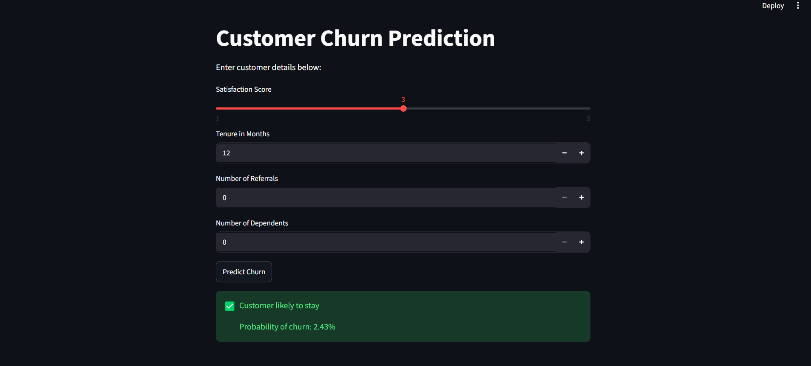
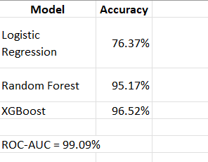
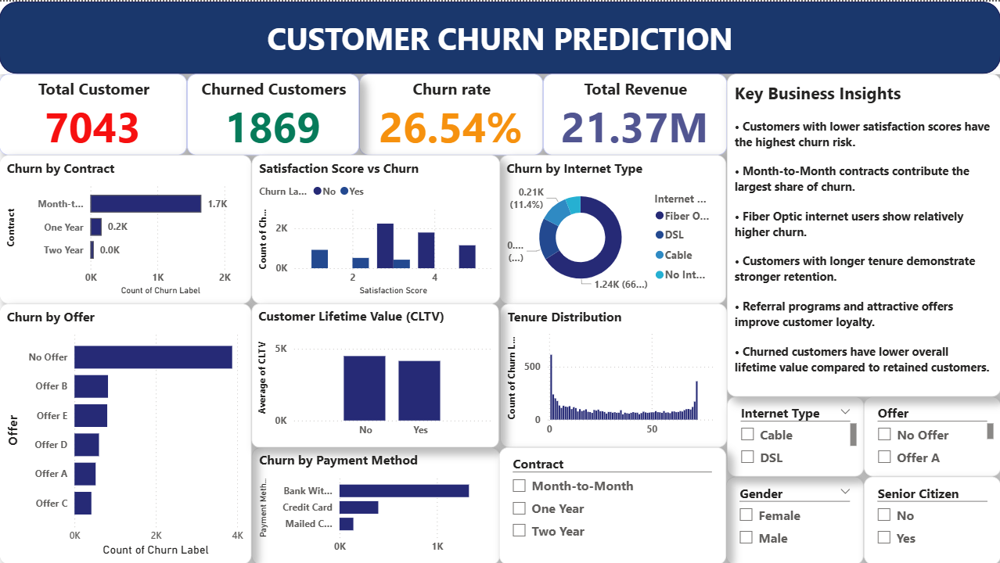

# Customer Churn Prediction

## Project Overview

This project predicts whether a customer is likely to churn using Machine Learning techniques. The objective is to help businesses identify at-risk customers and improve customer retention strategies.

The project includes:

* Machine Learning Model (XGBoost)
* Interactive Streamlit Web Application
* Power BI Dashboard
* Customer Churn Analysis

---

## Technologies Used

* Python
* Pandas
* NumPy
* Scikit-Learn
* XGBoost
* Streamlit
* Power BI

---

## Dataset Information

The dataset contains customer demographic information, account details, services subscribed, and churn status.

Features include:

* Gender
* Senior Citizen
* Partner
* Dependents
* Tenure
* Monthly Charges
* Total Charges
* Contract Type
* Internet Service
* Payment Method

Target Variable:

* Churn (Yes / No)

---

## Machine Learning Model

Algorithm Used:

* XGBoost Classifier

Model Objective:

* Predict customer churn probability
* Identify high-risk customers
* Support customer retention strategies

---

## Streamlit Application

The Streamlit application allows users to:

* Enter customer details
* Predict churn probability
* View prediction results instantly
* Support business decision making

### Streamlit App Screenshot



### Prediction Result



---

## Power BI Dashboard

The Power BI dashboard provides:

* Customer Churn Overview
* Churn Distribution
* Contract Analysis
* Customer Segmentation
* Business Insights

### Dashboard Screenshot



---

## Project Structure

```text
Customer-Churn-Prediction/
│
├── app.py
├── churn_model.pkl
├── model_columns.pkl
├── customer_churn_cleaned.csv
├── customer_churn_prediction.pbix
├── Customer_Churn_Prediction.ipynb
├── requirements.txt
├── README.md
├── app.png
├── model_result.png
└── dashboard.png
```

---

## Installation

Clone the repository:

```bash
git clone https://github.com/Prasitha-data/Customer-Churn-Prediction.git
```

Move into project folder:

```bash
cd Customer-Churn-Prediction
```

Install dependencies:

```bash
pip install -r requirements.txt
```

Run the Streamlit application:

```bash
streamlit run app.py
```

---

## Business Impact

* Improves customer retention
* Reduces revenue loss
* Identifies high-risk customers
* Supports data-driven decision making

---

## Developed By

**Prasitha**
